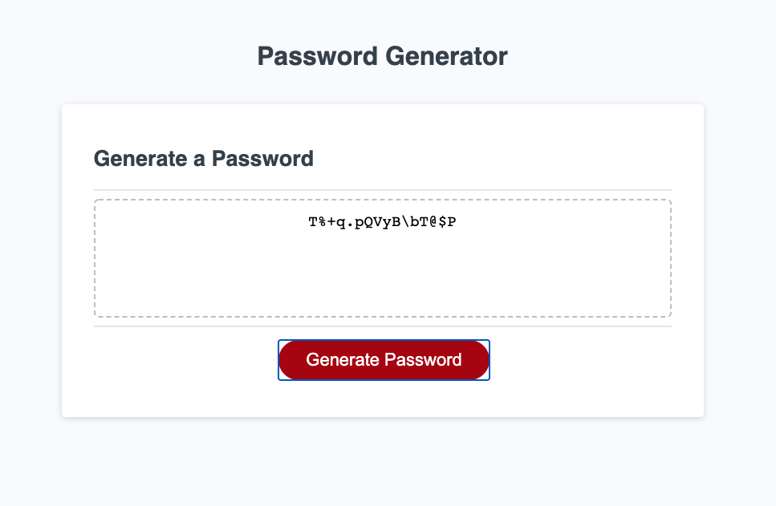
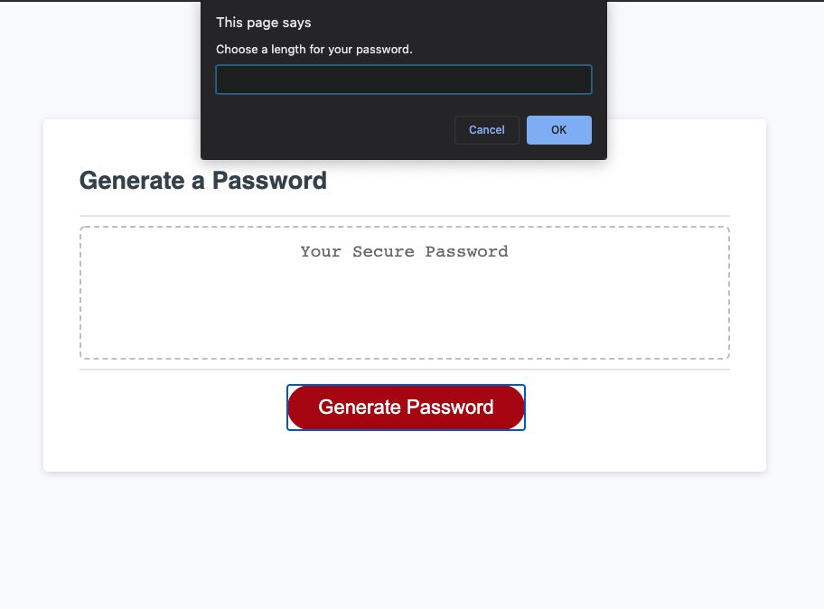
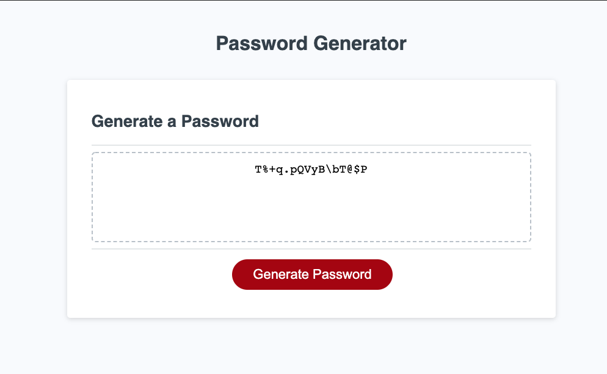

# Password Generator

This is a password generator built using JavaScript.

## Functions:
- User must choose between 8 - 128 characters.
- User can choose up to four different character types!
- View the password with randomly generated character in the textbox.

Try it out here: 

The following image demonstrates the application functionality:

<<<<<<< HEAD

=======

>>>>>>> 5bbd540d5d41a40e8ddc367bc528868bb40b60cb
