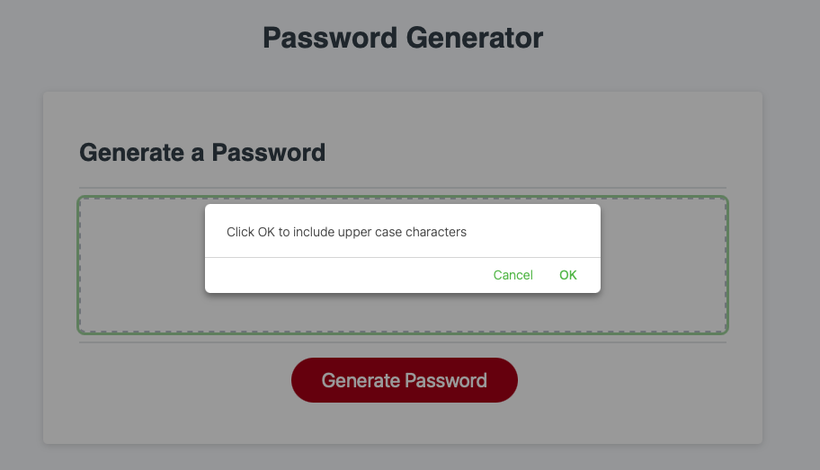
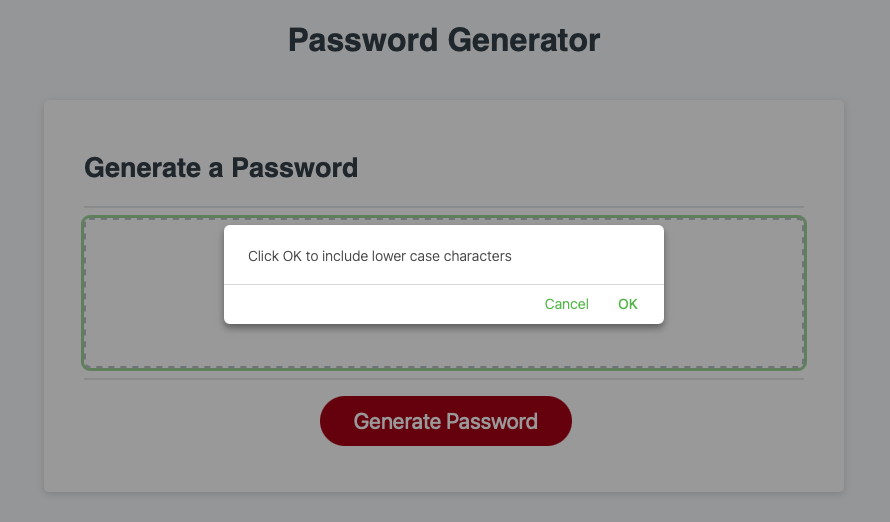

# Password Generator

This is a password generator built using JavaScript.

## Functions:
- User must choose between 8 - 128 characters.
- User can choose up to four different character types!
- View the password with randomly generated character in the textbox.

Try it out here: https://yusufjavid.github.io/Recoded_Passsword_Generator/

The following image demonstrates the application functionality:

<<<<<<< HEAD

=======
=======

